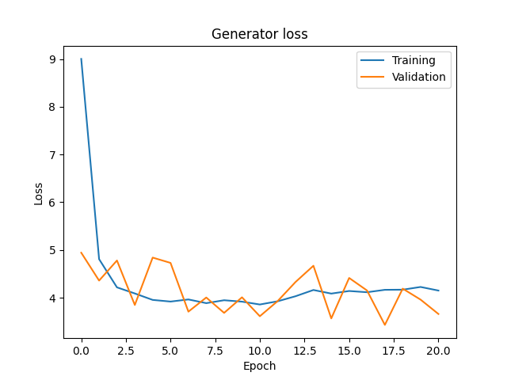
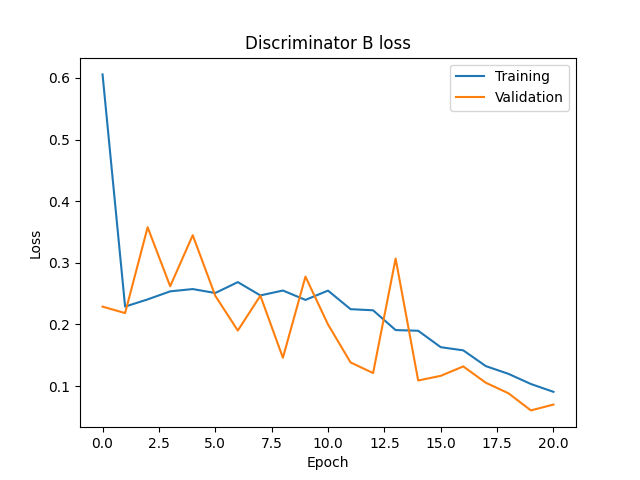

# Neurónové siete - projekt 3

**Autori:** Martin Šváb, Tomáš Ondruš

**Projekt:** CycleGAN

## Analýza dát

**Dataset:** Anime2Selfie

Náš dataset obsahuje 4000 obrázkov z domény A (anime) a 4400 obrázkov z domény B (selfie). Dáta sú v dostatočne dobrej kvalite a nie je nutné ich ďalje prespracovať. Pri načítaní ich pre zrýchlenie trénovania zmenšujeme na rozlíšenie 64x64. Dát je dostatočne veľa a nie je nutné ich augmentovať. Naše stiahnuté dáta už sú dopredu rozdelené na trénovaciu, validačnú a testovaciu sadu.

Doména A:

Doména B:

## Modely

V GAN potrebujeme trénovať 2 modely - generátor a diskriminátor. Generátor generuje falošné obrázky zo skutočných obrázkov a diskriminátor rozpoznáva falošné obrázky od pravdivých. Diskriminátor sa učí rýchlejšie ako generátor. Pri koverzii obrázkov medzi 2 doménami potrebujeme trénovať až 2 generátory a 2 diskriminátori.

Pre výpočet loss funkcie generátora používame nasledovné:

- **identity loss** - vykonáme konverziu do identickej domény
- **GAN loss** - vykonáme konverziu do inej domény
- **cycle loss** - falošný obrázok konvertujeme spätne do pôvodnej domény

Pre výpočet loss funkcie diskriminátora používame nasledovné:

- **fake loss** - identifikujeme falošný obrázok
- **real loss** - identifikujeme skutočný obrázok 

### CycleGAN generátor

Vstupný obrázok najskôr upravíme tak, aby obsahoval ngf kanálov. Obrázok zakódujeme pomocou konvolučných vrstiev. Následne ho transformujeme pomocou residuálnych blokov. Nakoniec ho dekódujeme pomocou konvolučných vrstiev a na výstupnej vrstve ho upravíme spät 3-kanálového obrázka.

	class CycleGANGenerator(nn.Module):
	    def __init__(self, in_channels, out_channels, ngf=64, n_downsampling=2, n_layers=6):
	        super().__init__()
	
	        # input
	        
	        self.input = nn.Sequential(
	            nn.ReflectionPad2d(3),
	            nn.Conv2d(in_channels, ngf, kernel_size=7, padding=0),
	            nn.InstanceNorm2d(ngf),
	            nn.ReLU(inplace=True) 
	        )
	
	        # encoder
	
	        encoder = []
	
	        in_features = ngf
	        out_features = ngf * 2
	        
	        for _ in range(n_downsampling):
	            encoder += [
	                nn.Conv2d(in_features, out_features, kernel_size=3, stride=2, padding=1),
	                nn.InstanceNorm2d(out_features),
	                nn.ReLU(inplace=True)
	            ]
	            
	            in_features = out_features
	            out_features = in_features*2
	
	        self.encoder = nn.Sequential(*encoder)
	        
	        # transformer
	
	        transformer = []
	
	        for _ in range(n_layers):
	            transformer += [
	                ResBlock(in_features)
	            ]
	
	        self.transformer = nn.Sequential(*transformer)
	        
	        # decoder
	
	        decoder = []
	
	        out_features = in_features//2
	        
	        for _ in range(n_downsampling):
	            decoder += [
	                nn.ConvTranspose2d(in_features, out_features, kernel_size=3, stride=2, padding=1, output_padding=1),
	                nn.InstanceNorm2d(out_features),
	                nn.ReLU(inplace=True)
	            ]
	            
	            in_features = out_features
	            out_features = in_features//2
	
	        self.decoder = nn.Sequential(*decoder)
	
	        # output
	
	        self.output = nn.Sequential(
	            nn.ReflectionPad2d(3),
	            nn.Conv2d(ngf, out_channels, kernel_size=7, padding=0),
	            nn.Tanh()
	        )
	
	    def forward(self, x):
	        x = self.input(x)
	        x = self.encoder(x)
	        x = self.transformer(x)
	        x = self.decoder(x)
	        x = self.output(x)
	
	        return x

### UVCGAN generátor

Architektúra je veľmi podobná vyššie opísanej CycleGAN architektúre. Sú tu pridané skip konekcie medzi kódovacími a dekódovacími blokmi (unet architektúra). V transformátore namiesto residuálnych blokov pouzívame PixelwiseVIT.

	class UVCGANGenerator(nn.Module):
    	def __init__(self, in_channels, out_channels, ngf=64, n_downsampling=2, n_layers=6):
    	    super().__init__()

        	# input

        	self.input = nn.Sequential(
            	nn.ReflectionPad2d(3),
	            nn.Conv2d(in_channels, ngf, kernel_size=7, padding=0),
            	nn.InstanceNorm2d(ngf),
            	nn.ReLU(inplace=True)
        	)

        	# encoder

        	encoder = []
        
	        in_features = ngf
	        out_features = ngf * 2
	        
        	for _ in range(n_downsampling):
            	encoder += [
            	    EncoderBlock(in_features, out_features)
            	]
            
            	in_features = out_features
	            out_features = in_features*2

    	    self.encoder = nn.Sequential(*encoder)
        
    	    # transformer
        
    	    dimension = int(64 / (2 ** n_downsampling))
    	    self.transformer = PixelwiseViT(
            	features=in_features,
            	n_heads=4,
            	n_blocks=4,
            	ffn_features=in_features*4,
            	embed_features=in_features,
            	activ='gelu',
            	norm=None,
            	image_shape=(in_features, dimension, dimension),
            	rezero=True
        	)
        	self.bottleneck = ConvBlock(in_features, out_features)
        
        	# decoder

        	decoder = []

        	in_features = out_features
        	out_features = in_features//2
        
        	for _ in range(n_downsampling):
            	decoder += [
            	    DecoderBlock(in_features, out_features)
            	]
            
            	in_features = out_features
            	out_features = in_features//2

        	self.decoder = nn.Sequential(*decoder)

        	# output

        	self.output = nn.Sequential(
            	nn.ReflectionPad2d(3),
	            nn.Conv2d(ngf*2, out_channels, kernel_size=7, padding=0),
    	        nn.Tanh()
    	    )

    	def forward(self, x):
    	    x = self.input(x)

    	    encoder_features = []
    	    for module in self.encoder:
    	        x, skip = module(x)
    	        encoder_features.append(skip)

    	    x = self.transformer(x)
    	    x = self.bottleneck(x)

    	    for i, module in enumerate(self.decoder):
    	        skip = encoder_features[-i-1]
    	        x = module(x, skip)

    	    x = self.output(x)

    	    return x

### Diskriminátor

Vstupný obrázok najskôr upravíme tak, aby obsahoval ndf kanálov. Nasleduje n konvolučných vrstiev. Na výstupnej vrstve upravíme obrvázok tak aby obsahoval 1 kanál (obrázok je skutočný alebo falošný).

	class Discriminator(nn.Module):
	    def __init__(self, in_channels, ndf=64, n_layers=3):
	        super().__init__()
	
	        model = [
	            nn.Conv2d(in_channels, ndf, kernel_size=4, stride=2, padding=1),
	            nn.LeakyReLU(0.2, True)
	        ]
	
	        in_features = ndf
	        out_features = ndf * 2
	        
	        for _ in range(1, n_layers):
	            model += [
	                nn.Conv2d(in_features, out_features, kernel_size=4, stride=2, padding=1),
	                nn.InstanceNorm2d(out_features),
	                nn.LeakyReLU(0.2, True)
	            ]
	
	            in_features = out_features
	            out_features = in_features * 2
	        
	        model += [
	            nn.Conv2d(in_features, out_features, kernel_size=4, stride=1, padding=1),
	            nn.InstanceNorm2d(out_features),
	            nn.LeakyReLU(0.2, True)
	        ]
	
	        model += [
	            nn.Conv2d(out_features, 1, kernel_size=4, stride=1, padding=1)
	        ]
	
	        self.model = nn.Sequential(*model)
	
	    def forward(self, x):
	        x = self.model(x)
	        return F.avg_pool2d(x, x.size()[2:]).view(x.size()[0], -1)

## Experimenty

V našich experimentoch porovnávame efektivity 2 rôznych architektúr - CycleGAN a UVCGAN. Obe architektúry používajú identický diskriminátor a pri trénovaní používajú identickú loss funkciu (MSELoss pre generovanie a L1Loss pre identitu a cyklus) a optimalizátor (Adam).

### CycleGAN

Skript:

	def experiment_CycleGAN():
	    print()
	    print('Running experiment CycleGAN')
	    print()

	    generator_A2B = CycleGANGenerator(3, 3)
	    generator_B2A = CycleGANGenerator(3, 3)
	    discriminator_A = Discriminator(3)
	    discriminator_B = Discriminator(3)
	
	    base_lr = 0.001
	    
	    config = {
	        'datamodule': DataModule(),
	        'generator_A2B': generator_A2B,
	        'generator_B2A': generator_B2A,
	        'discriminator_A': discriminator_A,
	        'discriminator_B': discriminator_B,
	        'criterion_GAN': nn.MSELoss(),
	        'criterion_cycle': nn.L1Loss(),
	        'criterion_identity': nn.L1Loss(),
	        'optimizer_G': optim.Adam(itertools.chain(generator_A2B.parameters(), generator_B2A.parameters()), lr=base_lr),
	        'optimizer_D_A': optim.Adam(discriminator_A.parameters(), lr=4*base_lr),
	        'optimizer_D_B': optim.Adam(discriminator_B.parameters(), lr=4*base_lr),
	        'max_epoch': 20,
	        'output_dir': '../output/cyclegan'
	    }
	    
	    trainer = Trainer(config)
	    trainer.fit()

Grafy:

Generované obrázky (A->B):

Generované obrázky (B->A):

Pri testovaní náš generátor dosiahol loss 4.78456, náš diskriminátor A dosiahol loss 0.17798 a diskriminátor B dosiahol loss 0.18013.

### UVCGAN

Skript:

	def experiment_UVCGAN():
	    print()
	    print('Running experiment UVCGAN')
	    print()

	    generator_A2B = UVCGANGenerator(3, 3)
    	generator_B2A = UVCGANGenerator(3, 3)
    	discriminator_A = Discriminator(3)
    	discriminator_B = Discriminator(3)

    	base_lr = 0.001
    
    	config = {
        	'datamodule': DataModule(),
	        'generator_A2B': generator_A2B,
        	'generator_B2A': generator_B2A,
        	'discriminator_A': discriminator_A,
        	'discriminator_B': discriminator_B,
        	'criterion_GAN': nn.MSELoss(),
        	'criterion_cycle': nn.L1Loss(),
        	'criterion_identity': nn.L1Loss(),
        	'optimizer_G': optim.Adam(itertools.chain(generator_A2B.parameters(), generator_B2A.parameters()), lr=base_lr),
        	'optimizer_D_A': optim.Adam(discriminator_A.parameters(), lr=4*base_lr),
        	'optimizer_D_B': optim.Adam(discriminator_B.parameters(), lr=4*base_lr),
        	'max_epoch': 20,
        	'output_dir': '../output/uvcgan'
    	}
    
    	trainer = Trainer(config)
    	trainer.fit()

Grafy:

Generované obrázky (A->B):

Generované obrázky (B->A):

Pri testovaní náš generátor dosiahol loss 4.90497, náš diskriminátor A dosiahol loss 0.18863 a diskriminátor B dosiahol loss 0.18398.

## Vyhodnotenie

Z našich grafov nevidíme veľký rozdiel medzi architektúrami. V oboch prípadoch po 3 epoche sa nezlepšuje loss ani generátora ani diskriminátora. Tieto informácie však môžu byť zavádzajúce, lebo učíme 2 typy modelov, ktoré súperia proti sebe. Ak sa zlepšujú rovnakým tempom, tak naše loss funkcie budú len mierne kolísať.

Vygenerované obrázky pri oboch architektúrach dosahujú nedostatočnú kvalitu. Pre dosiahnutie lepších výsledkov by bolo nutné zvýšit rozlíšenie vstupných obrázkov alebo upraviť architektúru.